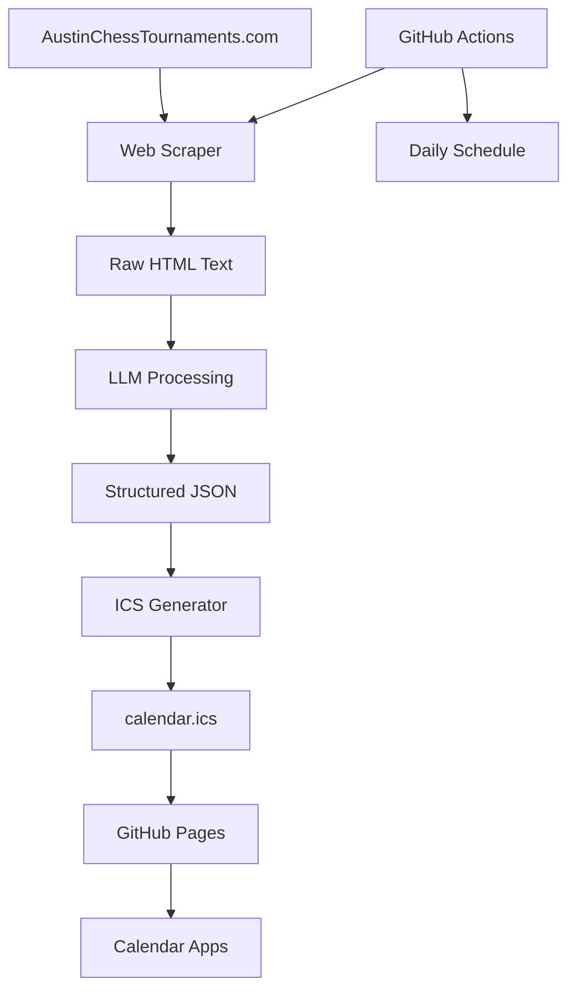

# 📅 Chess Tournament Calendar Feed

Automated calendar feed for chess tournaments from [AustinChessTournaments.com](https://www.austinchesstournaments.com/events/), compatible with Apple Calendar and other calendar applications.

## 🚀 Features

- **🕷️ Web Scraping**: Automatically extracts tournament data from the source website
- **🧠 AI Processing**: Uses LLM to convert unstructured text into structured calendar events
- **📅 Multi-Day Event Support**: Automatically detects and properly formats camps, tournaments spanning multiple days
- **📅 ICS Generation**: Creates standard iCalendar files compatible with all major calendar apps
- **🔄 Auto-Updates**: Daily refresh via GitHub Actions
- **📱 Apple Calendar**: Direct subscription support with automatic sync

## 🔗 Calendar Feed URL

Once deployed, your calendar feed will be available at:
```
https://YOUR_USERNAME.github.io/YOUR_REPO_NAME/calendar.ics
```

## 📱 Subscribe in Apple Calendar

1. Open Apple Calendar
2. Go to `File → New Calendar Subscription` (or `Calendar → Add Account → Other → CalDAV`)
3. Paste the calendar feed URL above
4. Set refresh interval (recommended: Daily or Weekly)
5. Choose calendar name and color

## 🛠️ Setup Instructions

### 1. Fork/Clone Repository
```bash
git clone https://github.com/YOUR_USERNAME/YOUR_REPO_NAME.git
cd YOUR_REPO_NAME
```

### 2. Install Dependencies
```bash
pip install -r requirements.txt
```

### 3. Test Locally
```bash
python generate_calendar.py
```

### 4. Enable GitHub Pages
1. Go to your repository on GitHub
2. Navigate to `Settings → Pages`
3. Set source to `Deploy from a branch`
4. Select branch: `main` and folder: `/ (root)`
5. Save settings

### 5. Enable GitHub Actions
The workflow will automatically run:
- Daily at 6 AM UTC
- On pushes to main branch
- Manually via GitHub Actions tab

## 🏗️ Architecture



## 📁 Project Structure

```
├── generate_calendar.py      # Main script
├── requirements.txt          # Python dependencies
├── calendar.ics             # Generated calendar file
├── .github/
│   └── workflows/
│       └── update-calendar.yml  # GitHub Actions workflow
├── test_calendar.py         # Unit tests
└── README.md               # This file
```

## 🗓️ Multi-Day Event Support

The system automatically detects and properly formats multi-day events:

### **Event Types Supported:**
- **📚 Chess Camps**: Week-long camps appear as all-day events spanning multiple days
- **🏆 Multi-Day Tournaments**: Tournaments spanning several days are properly formatted
- **📅 Single-Day Events**: Regular tournaments with specific start/end times

### **How It Works:**
1. **LLM Detection**: AI analyzes event descriptions to identify multi-day events
2. **Smart Formatting**:
   - Multi-day events → All-day calendar entries
   - Single-day events → Timed entries with 3-hour duration
3. **Calendar Display**: Events appear correctly in Apple Calendar and other apps

### **Example Output:**
```
Chess Summer Camp (July 7-11) → All-day event spanning 5 days
Austin Open Tournament (Aug 15) → 12:00 PM - 3:00 PM single day
```

## 🧪 Testing

Run the test suite:
```bash
pytest test_calendar.py -v
```

## 🔧 Configuration

### Environment Variables (Optional)
- `CHESS_CALENDAR_URL`: Override source URL
- `CHESS_CALENDAR_OUTPUT`: Override output filename

### Customization
Edit `generate_calendar.py` to:
- Change event duration (default: 3 hours)
- Modify LLM prompt for better parsing
- Add additional event fields
- Change retry logic parameters

## 🐛 Troubleshooting

### Common Issues

**Calendar not updating:**
- Check GitHub Actions logs in the Actions tab
- Verify GitHub Pages is enabled
- Ensure repository is public

**No events found:**
- Website structure may have changed
- Check scraping selectors in `scrape_events()` method
- Review logs for specific error messages

**LLM parsing errors:**
- Increase retry attempts in `call_llm_with_retry()`
- Modify the prompt for better results
- Check Hack Club AI service status

### Debug Mode
Run with verbose logging:
```bash
python -c "
import logging
logging.basicConfig(level=logging.DEBUG)
from generate_calendar import main
main()
"
```

## 🤝 Contributing

1. Fork the repository
2. Create a feature branch
3. Make your changes
4. Add tests for new functionality
5. Submit a pull request

## 📄 License

MIT License - feel free to use and modify for your own chess communities!

## 🙏 Acknowledgments

- [AustinChessTournaments.com](https://www.austinchesstournaments.com/) for tournament data
- [Hack Club AI](https://ai.hackclub.com/) for LLM processing
- [ics library](https://pypi.org/project/ics/) for calendar generation

---

**Made with ♟️ for the chess community**
